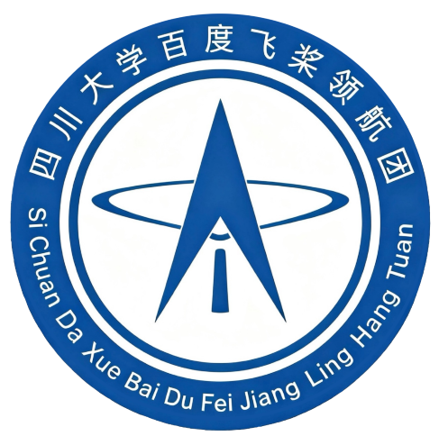

<div align="center">



# 🐼 四川大学飞桨领航团

### SCU PaddlePaddle Pioneer Group

**一起学 AI · 一起做项目 · 一起把想法变成现实**

<p>
  <a href="https://github.com/SCU-PaddlePaddle-Pioneer-Group">
    
  </a>
  <a href="https://www.paddlepaddle.org.cn/">
    
  </a>
  
  
</p>

<p>
  <a href="#-关于我们">关于我们</a> ·
  <a href="#-我们在做什么">我们在做什么</a> ·
  <a href="#-如何参与">如何参与</a> ·
  <a href="#-近期计划">近期计划</a>
</p>

</div>

<br />

> 四川大学飞桨领航团，是一个面向四川大学同学的 AI 学习、技术实践与创新交流社区。
> 我们以飞桨为起点，连接课程、代码、项目与真实问题，让每一次学习都能沉淀为可复用的成果。

## 🧭 关于我们

我们相信，AI 的学习不应该止步于“看懂了教程”，更应该经历完整的过程：

```text
好奇心 → 学习基础 → 动手实践 → 团队协作 → 开源分享 → 持续迭代
```

领航团希望为同学们提供一个开放、友好、重视实践的开发者空间：

- **从基础出发**：一起补齐 Python、机器学习、深度学习与工程实践基础。
- **用项目学习**：围绕真实问题完成从想法、实验到部署的完整闭环。
- **在协作中成长**：通过 Issue、Pull Request、Code Review 和技术分享积累团队经验。
- **把成果留下来**：沉淀学习笔记、实验记录、工具脚本和可复用项目，持续建设公开技术社区。

## 🚀 我们在做什么

| 方向 | 我们关注的内容 |
| :--- | :--- |
| 📚 **AI 学习** | 机器学习、深度学习、计算机视觉、自然语言处理与生成式 AI |
| 🧪 **技术实践** | 数据处理、模型训练、评估调优、推理部署与应用开发 |
| 🛠️ **项目创新** | 从需求分析到 Demo 落地，鼓励跨专业、跨方向组队协作 |
| 🌱 **开源共建** | 教程、代码、实验复现、项目文档与面向新人的入门材料 |
| 🎤 **交流分享** | 学习路线分享、论文导读、项目复盘与技术主题交流 |

## 🗺️ 公开内容地图

组织仓库正在持续建设中，后续将逐步开放以下内容：

| 内容类型 | 计划沉淀的内容 | 状态 |
| :--- | :--- | :---: |
| 学习资料 | 入门路线、课程笔记、实践清单 | 🚧 建设中 |
| 实验项目 | 可复现的 AI 实验与小型项目 | 🚧 建设中 |
| 工程模板 | 项目脚手架、训练配置、部署示例 | 🚧 建设中 |
| 活动记录 | 技术分享、项目复盘、优秀作品 | 🚧 建设中 |

> 想优先参与某个方向？欢迎通过 [组织主页](https://github.com/SCU-PaddlePaddle-Pioneer-Group) 关注后续仓库与项目发布。

## 🤝 如何参与

无论你是刚开始接触 AI，还是已经有项目经验，都可以找到适合自己的参与方式：

1. **关注组织**：查看最新仓库、项目和活动信息。
2. **从一个小问题开始**：阅读文档、运行示例、提出 Issue，或补充一个错别字。
3. **提交你的改进**：按照项目说明提交 Pull Request，与大家一起完成 Code Review。
4. **分享你的收获**：把实验结果、踩坑记录和项目经验整理成文档，帮助下一个人更快上手。

### 🌟 第一次贡献可以从这里开始

- 改进一段说明，让它更容易被新同学看懂；
- 复现实验并补充运行环境与结果；
- 为项目增加一个示例、测试或可视化；
- 提出一个值得尝试的想法，和大家一起把它变成计划。

## 🧑‍💻 协作约定

为了让项目更容易参与，我们提倡：

- 文档先行：README、运行方式和预期结果尽量写清楚；
- 小步提交：每次提交聚焦一个问题，方便讨论和 Review；
- 尊重彼此：对事不对人，欢迎不同背景和不同观点；
- 注重复现：记录依赖、数据来源、关键参数与实验环境；
- 鼓励分享：不只展示成功结果，也欢迎真实的失败与复盘。

## 📌 近期计划

- [ ] 完成组织仓库与项目目录规划
- [ ] 整理 AI / 深度学习入门学习路线
- [ ] 发布第一批可复现实验与实践项目
- [ ] 建立 Issue、Pull Request 与 Code Review 协作流程
- [ ] 持续记录技术分享、项目复盘与成员作品

## 🔗 相关链接

- [组织主页](https://github.com/SCU-PaddlePaddle-Pioneer-Group)
- [飞桨官方网站](https://www.paddlepaddle.org.cn/)
- [PaddlePaddle GitHub](https://github.com/PaddlePaddle/Paddle)

<div align="center">

<br />

### 让 AI 学习更有趣，让技术实践真正发生。

**Paddle Forward · Pioneer Together**

<sub>Built with curiosity, code and open source · 四川大学飞桨领航团</sub>

</div>
